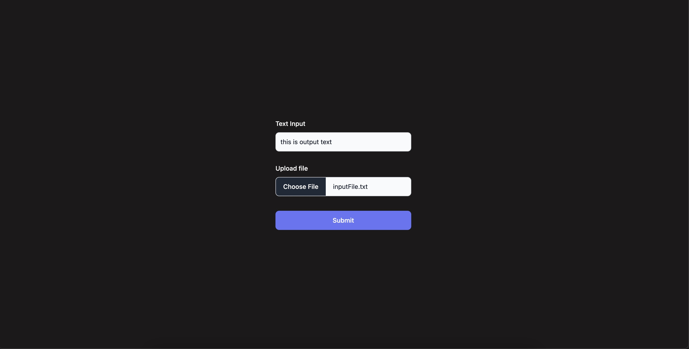
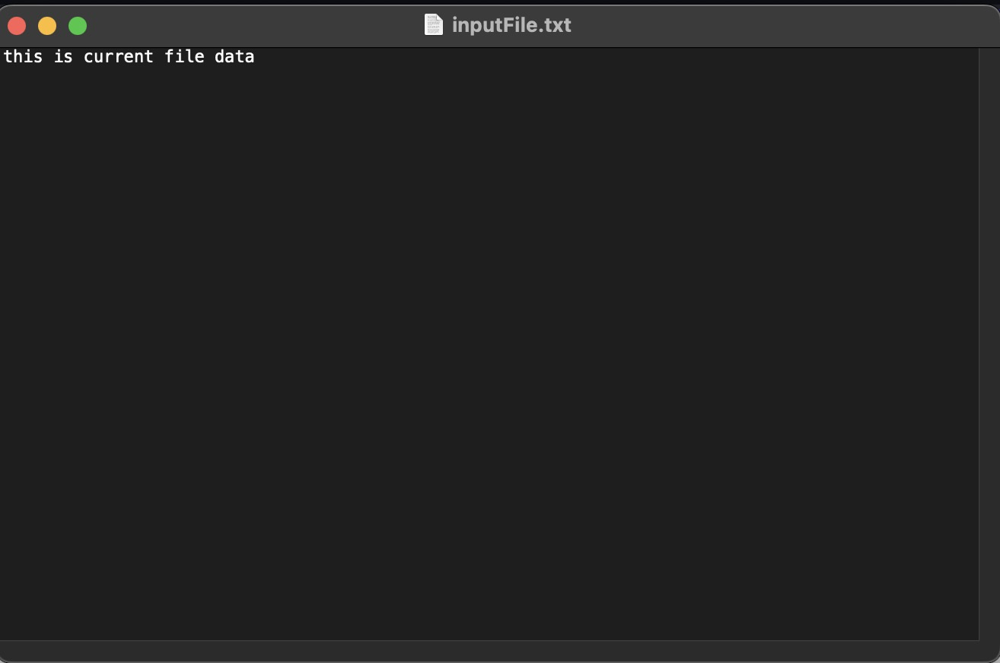
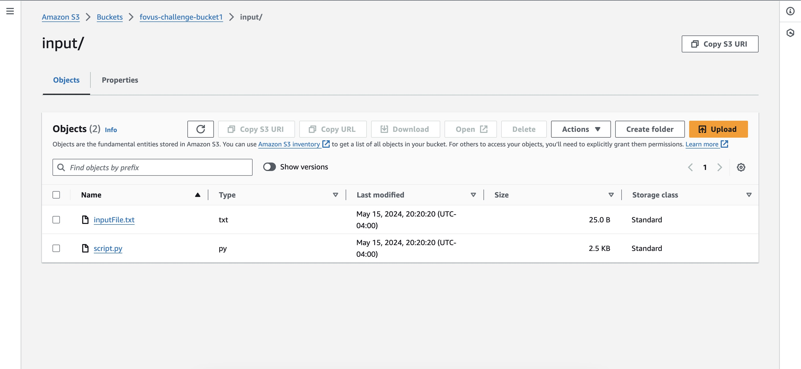
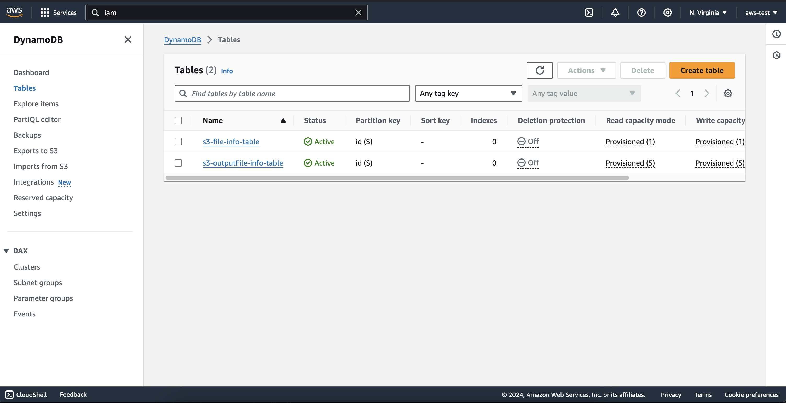
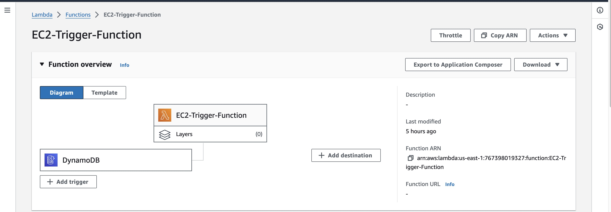
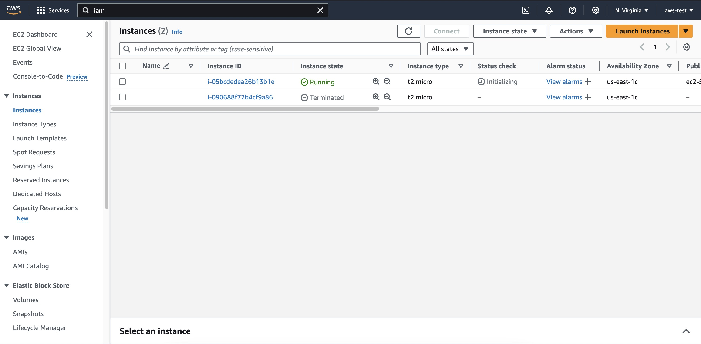
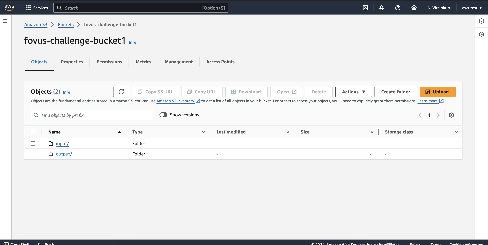
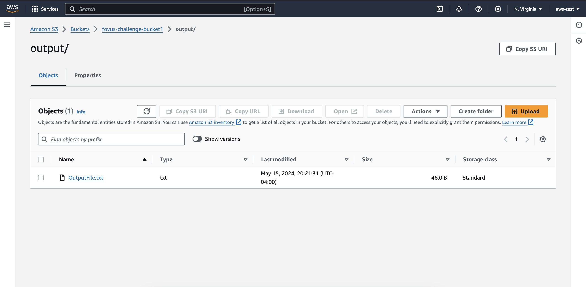
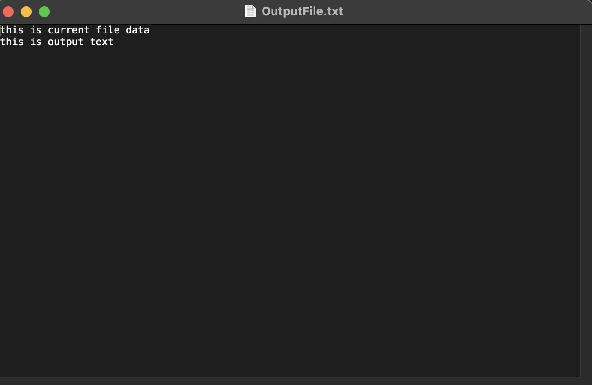

# Introduction

Welcome to our project repository! This project was developed as part of a coding challenge designed to showcase our skills in handling AWS services, specifically focusing on automation and integration between various AWS components. The core functionality revolves around automating the deployment and management of AWS resources using Lambda functions.


## Project Overview

The objective of this coding challenge is to demonstrate a practical application of AWS services by creating a fully automated process that reacts to changes in a DynamoDB table to perform specific tasks. The project simulates a real-world scenario where uploaded files and their metadata are managed in a highly dynamic environment, utilizing AWS's scalable and managed services.

## What the Project Does

The project accomplishes the following:

- Automated EC2 Instance Management: Utilizes AWS Lambda to automatically launch EC2 instances based on triggers defined by changes in a DynamoDB table. This aspect of the project shows how to programmatically control EC2 instances for processing tasks.

- File Processing and Storage: Once an EC2 instance is up and running, it automatically fetches and processes a specified file from an S3 bucket, performs predetermined operations, and stores the results back in S3, demonstrating a seamless flow of data across AWS services.

- Dynamic Data Updates: The project also includes mechanisms to update a DynamoDB table with the outcomes of the file processing, ensuring that all components are kept in sync with the latest data.

## Setup and Running the project

This project consists of two main components: the frontend and the backend. Below are the detailed steps to set up and run both parts of the project on your local machine.
### Prerequisites

Before you begin, ensure you have the following installed:

- Node.js and npm (Node Package Manager). 
- An IDE or a text editor for editing the code (such as VS Code, Sublime Text, or Atom).

### Backend Setup

1. **Navigate to the Backend Directory:**
Open a terminal and change to the backend directory of the project:
```

cd /backend

```
2. **Install Dependencies:**
Run the following command to install the necessary npm packages defined in package.json:
```

npm install

```
3. **Build the Project:**
Since the backend is written in TypeScript, you need to compile the TypeScript files into JavaScript before running the server. Execute the build script with:
```

npm run build

```

This command compiles the TypeScript files and outputs the JavaScript files to a designated dist or build directory.

4. **Start the Backend Server:**
Once the build process is complete, start the server using:
```

npm start

```

This command will launch the Node.js server on port 3002.


## Frontend Setup 
1. **Navigate to the Frontend Directory:**
Open another terminal and change to the frontend directory of the project:

```

cd /frontend

```

2. **Install Dependencies:**
Just like with the backend, begin by installing all required npm packages:

```

npm install

```
3. **Start the Frontend Application:**
Run the frontend application using:

```

npm start

```
This command will compile the frontend source files and open the application in your default web browser. The frontend should now be accessible at **http://localhost:3000**.

## Final Steps

Once both the frontend and backend are running, you should be able to interact with the application through your web browser at **localhost:3000**. This setup allows you to develop and test the application locally.

## References
1. https://docs.aws.amazon.com/IAM/latest/UserGuide/id_credentials_access-keys.html
2. https://docs.aws.amazon.com/apigateway/latest/developerguide/integrating-api-with-aws-services-s3.html
3. https://docs.aws.amazon.com/amazondynamodb/latest/developerguide/Streams.Lambda.Tutorial2.html
4. https://boto3.amazonaws.com/v1/documentation/api/latest/reference/services/ec2/client/run_instances.html
5. https://docs.aws.amazon.com/amazondynamodb/latest/developerguide/Streams.Lambda.html
6. https://tmmr.uk/post/upload-to-s3-through-api-gateway/
7. https://medium.com/@the.nick.miller/use-python-lambdas-to-remotely-run-shell-commands-on-ec2-instances-57a92a2f5943
8. https://docs.aws.amazon.com/AWSEC2/latest/UserGuide/working-with-security-groups.html#creating-security-group
9. https://docs.aws.amazon.com/cli/latest/reference/ec2/terminate-instances.html

## Screenshots












